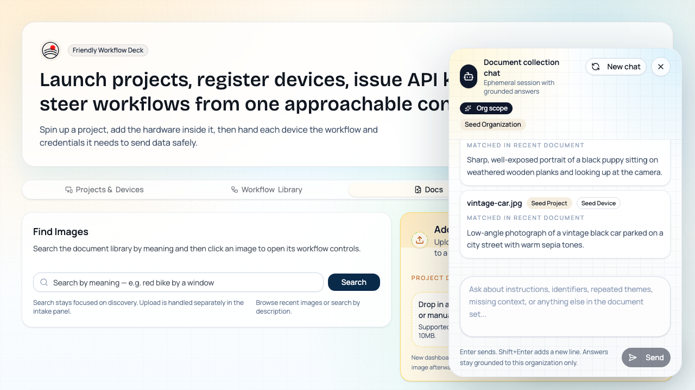
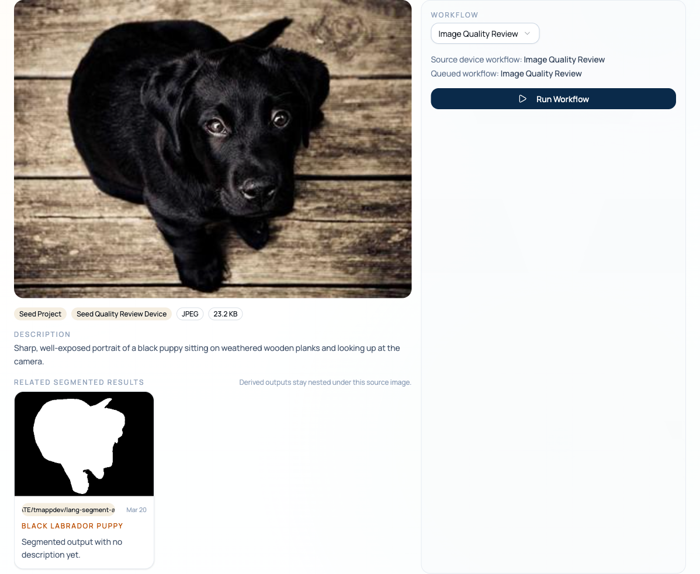

<p align="center">
  
</p>

<h1 align="center">Arcnem Vision</h1>

<p align="center">
  <strong>Teach machines to see. Let agents decide what to do about it.</strong>
</p>

<p align="center">
  <a href="README.ja.md">日本語</a> ·
  <a href="#quickstart">Quickstart</a> ·
  <a href="#architecture">Architecture</a> ·
  <a href="site/">Docs Site</a> ·
  <a href="docs/">Deep Dives</a>
</p>

---

Arcnem Vision is an open-source platform that turns images into understanding. Upload a photo from the Flutter app or directly from the dashboard, and a swarm of AI agents — orchestrated by LangGraph, connected through MCP, and configured entirely from a database — will extract OCR text, generate embeddings, write descriptions, branch through deterministic condition nodes or supervisor loops, run segmentation models, and make everything searchable by meaning, not just metadata.

Four languages. Five services. One pipeline from camera shutter to semantic search.

> **Two API keys. That's it.** Grab an [OpenAI API key](https://platform.openai.com/api-keys) and a [Replicate API token](https://replicate.com/account/api-tokens). Everything else — Postgres, Redis, S3, Inngest — runs locally via `docker compose`.

**What makes it interesting:**

- **Database-driven agent graphs** — Define AI workflows as rows, not code. Mix worker, tool, supervisor, and condition nodes per organization without redeploying anything.
- **GenUI chat interface** — The AI doesn't just reply with text. It generates real Flutter widgets at runtime — cards, galleries, interactive components — composed from JSON.
- **On-device Gemma** — Intent parsing happens locally on the phone before anything hits the network. Private by default.
- **CLIP vector search** — Images and their descriptions are embedded in the same 768-dimensional space. Search by image, by text, or by vibes.
- **Dashboard control room** — Manage projects, devices, API keys, workflow assignments, and one-off dashboard uploads from the same UI.
- **Grounded document collection chat** — Ask the Docs tab about the current collection and get answers grounded in OCR, descriptions, and segmentation context with source cards.
- **Visual workflow builder** — Drag-and-drop agent graphs with workers, tools, supervisors, condition nodes, edges, and reusable workflow templates.
- **OCR-aware document review** — OCR runs as a first-class MCP tool, stores extracted text plus confidence metadata, and can feed either rule-based routing or specialist review loops.
- **Realtime operator feedback** — The Docs and Runs tabs update as uploads land, OCR results persist, descriptions finish, segmentations appear, and graph steps advance.
- **MCP tools as a first-class primitive** — CLIP embeddings, descriptions, OCR, similarity search, and segmentation models all sit behind MCP. Agents call them. You can too.

## Tech Stack

| Layer         | Tech                                           | What it does                                                               |
| ------------- | ---------------------------------------------- | -------------------------------------------------------------------------- |
| **Client**    | Flutter, Dart, flutter_gemma, GenUI, fpdart    | Camera capture, on-device LLM, AI-generated UI, functional error handling  |
| **API**       | Bun, Hono, better-auth, Inngest, Pino          | REST routes, presigned uploads, durable job scheduling, structured logging |
| **Dashboard** | React 19, TanStack Router, Tailwind, shadcn/ui | Workflow builder, project/device/API key management, live operations UI    |
| **Agents**    | Go, Gin, LangGraph, LangChain, inngestgo       | Graph-based agent orchestration, ReAct workers, step-level tracing         |
| **MCP**       | Go, MCP go-sdk, replicate-go, GORM             | CLIP embeddings, description generation, OCR, segmentation, similarity search |
| **Storage**   | Postgres 18 + pgvector, S3-compatible, Redis   | Vector indexes, object storage, session cache                              |

## Architecture

```
┌─────────────┐     ┌──────────────┐     ┌─────────────────┐
│   Flutter    │────▶│   Hono API   │────▶│     Inngest     │
│   Client     │     │   (Bun)      │     │   Event Queue   │
│              │     │              │     │                 │
│ GenUI + Gemma│     │ Presigned S3 │     └────────┬────────┘
└─────────────┘     │ better-auth  │              │
                    └──────────────┘              ▼
┌─────────────┐                        ┌──────────────────┐
│    React     │                        │   Go Agents      │
│  Dashboard   │                        │                  │
│              │     ┌──────────┐       │ LangGraph loads  │
│  Workflow    │────▶│ Postgres │◀──────│ graph from DB,   │
│  Builder     │     │ pgvector │       │ executes nodes   │
└─────────────┘     └──────────┘       └────────┬─────────┘
                         ▲                      │
                         │               ┌──────▼─────────┐
                    ┌────┴───┐           │   MCP Server    │
                    │   S3   │           │                 │
                    │Storage │           │ OCR, CLIP,      │
                    └────────┘           │ Descriptions,   │
                                         │ Search, Segment │
                                         └─────────────────┘
```

**The pipeline:** Client captures image → API issues presigned S3 URL → Client uploads directly → API acknowledges and fires Inngest event → Go agent service loads the document's agent graph from Postgres → LangGraph builds and executes the workflow → Worker nodes call LLMs, tool/condition/supervisor nodes route the work → MCP generates OCR, descriptions, embeddings, and segmentations → Everything lands in Postgres with HNSW cosine indexes plus persisted OCR results → Searchable by meaning.

## Screenshots

| Flutter Client | Dashboard — Projects & Devices |
|---|---|
|  |  |

| Workflow Library | Docs Search & Chat |
|---|---|
|  |  |

| Selected Document & Segmentation | Agent Run Details |
|---|---|
|  |  |

**Agent graphs are data, not code.** Templates define reusable workflows with nodes, edges, and tools. Instances bind templates to organizations. Four node types:

- **Worker** — ReAct agent with access to MCP tools
- **Tool** — Single MCP tool invocation with input/output mapping
- **Supervisor** — Multi-agent orchestration across workers
- **Condition** — Deterministic branching on state with `contains` / `equals` checks and explicit true/false targets

Every execution is traced step-by-step in `agent_graph_runs` and `agent_graph_run_steps` — state deltas, timing, errors, the full picture. OCR payloads are persisted separately in `document_ocr_results` so operators can inspect extracted text and confidence without digging through raw run state. The dashboard's Docs tab sits on top of that same material, combining semantic search with a grounded collection chat that cites matching documents.

## Repository Layout

```
arcnem-vision/
├── client/                 Flutter app — GenUI, Gemma, camera, gallery
│   ├── lib/screens/        Auth, camera, dashboard, loading
│   ├── lib/services/       Upload, document, GenUI, intent parsing
│   └── lib/catalog/        Custom widget catalog for AI-generated UI
├── server/                 Bun workspace
│   ├── packages/api/       Hono routes, middleware, auth, S3, Inngest
│   ├── packages/db/        Drizzle schema (23 tables), migrations, seed
│   ├── packages/dashboard/ React admin — workflow builder, doc viewer
│   └── packages/shared/    Env helpers
├── models/                 Go workspace
│   ├── agents/             Inngest handlers, LangGraph execution engine
│   ├── mcp/                MCP server — 7 tools (descriptions, OCR, embeddings, segmentation, search)
│   ├── db/                 GORM gen introspection (schema → Go models)
│   └── shared/             Common env loading
└── docs/                   Deep dives — embeddings, LangChain, LangGraph, GenUI
```

## Quickstart

### 1. Clone and configure

```bash
git clone https://github.com/arcnem-ai/arcnem-vision.git
cd arcnem-vision
```

Copy every `.env.example` to `.env`:

```bash
cp server/packages/api/.env.example server/packages/api/.env
cp server/packages/db/.env.example  server/packages/db/.env
cp server/packages/dashboard/.env.example server/packages/dashboard/.env
cp models/agents/.env.example       models/agents/.env
cp models/mcp/.env.example          models/mcp/.env
cp client/.env.example              client/.env
```

Add your two API keys — the only external services required:

- **[OpenAI API key](https://platform.openai.com/api-keys)** → `OPENAI_API_KEY` in `models/agents/.env`
- **Same OpenAI key (recommended)** → `OPENAI_API_KEY` in `server/packages/dashboard/.env` if you want the Docs tab's collection chat enabled locally
- **[Replicate API token](https://replicate.com/account/api-tokens)** → `REPLICATE_API_TOKEN` in `models/mcp/.env`

Everything else is already configured for local development. Database, S3, and Redis all run in Docker via `docker-compose.yaml` — the `.env.example` defaults point to them out of the box.

### 2. Start everything

```bash
tilt up
```

That's it. Tilt installs all dependencies, starts Postgres/Redis/MinIO, runs migrations, and launches every service — API, dashboard, agents, MCP, Inngest, Flutter client, and the docs site. Open the Tilt UI at `http://localhost:10350` to watch logs and manage resources.

### 3. Seed the database

In the Tilt UI, click the **seed-database** resource and hit the trigger button. The seed now creates a demo organization with projects, devices, API keys, newer sample images, OCR keyword-routing and OCR supervisor showcase workflows, and segmentation showcase workflows. It also prints a usable API key — set `DEBUG_SEED_API_KEY=...` in `client/.env` for auto-auth in the Flutter app during development.

### Health checks

```
GET http://localhost:3000/health   # API
GET http://localhost:3020/health   # Agents
GET http://localhost:3021/health   # MCP
```

### S3 config details

Default local dev uses MinIO from `docker-compose.yaml`. The `.env.example` files ship with working defaults:

- `S3_ACCESS_KEY_ID=minioadmin`
- `S3_SECRET_ACCESS_KEY=minioadmin`
- `S3_BUCKET=arcnem-vision`
- `S3_ENDPOINT=http://localhost:9000`
- `S3_REGION=us-east-1`
- `S3_USE_PATH_STYLE=true` (agents only)

For hosted storage, substitute your AWS S3, Cloudflare R2, Railway Object Storage, or Backblaze B2 credentials.

## API Example

```bash
# 1. Get a presigned upload URL
curl -X POST http://localhost:3000/api/uploads/presign \
  -H "Content-Type: application/json" \
  -H "x-api-key: ${API_KEY}" \
  -d '{"contentType":"image/png","size":12345}'

# 2. Upload directly to S3 with the returned uploadUrl
curl -X PUT "${UPLOAD_URL}" --data-binary @photo.png

# 3. Acknowledge — triggers the full agent pipeline
curl -X POST http://localhost:3000/api/uploads/ack \
  -H "Content-Type: application/json" \
  -H "x-api-key: ${API_KEY}" \
  -d '{"objectKey":"uploads/.../photo.png"}'
```

After step 3, Inngest fires `document/process.upload`. The agent graph takes it from there — OCR, description generation, embedding, routing, vector indexing, whatever the assigned workflow defines.

## Requirements

- Docker + Docker Compose
- Bun (server)
- Go 1.25+ (agents, MCP)
- CompileDaemon (`go install github.com/githubnemo/CompileDaemon@latest`)
- Flutter SDK (client)
- Tilt

## Documentation

| Doc                                        | What's in it                                                                       |
| ------------------------------------------ | ---------------------------------------------------------------------------------- |
| [site/](site/)                             | Local docs site (Starlight) for onboarding and reference pages                     |
| [docs/embeddings.md](docs/embeddings.md)   | Current embedding implementation and operational constraints                       |
| [docs/langgraphgo.md](docs/langgraphgo.md) | Graph orchestration patterns, condition nodes, supervisor routing, checkpointing |
| [docs/langchaingo.md](docs/langchaingo.md) | LLM providers, chains, agents, tools, MCP bridging                                 |
| [docs/genui.md](docs/genui.md)             | Flutter GenUI SDK, DataModel binding, A2UI protocol, custom widgets                |

## Contributing

See [CONTRIBUTING.md](CONTRIBUTING.md) for contributor workflow. If you use AI coding agents, also read [AGENTS.md](AGENTS.md).

---

<p align="center">
  Built by <a href="https://arcnem.ai">Arcnem AI</a> in Tokyo.
</p>
